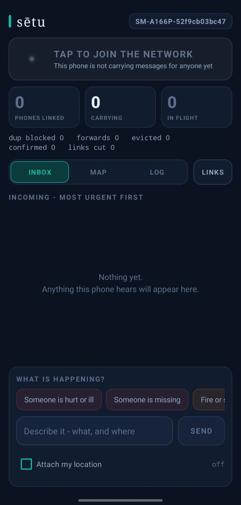
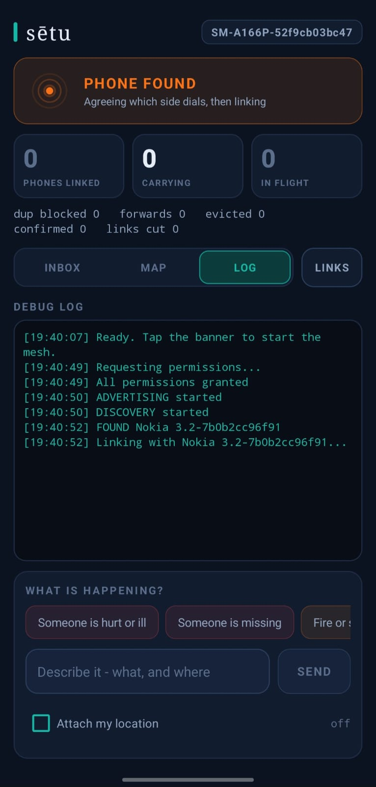
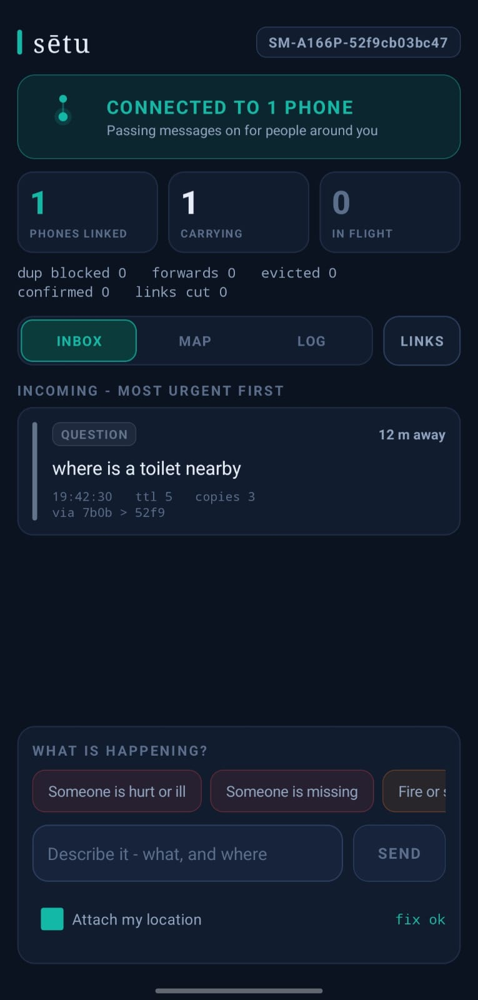
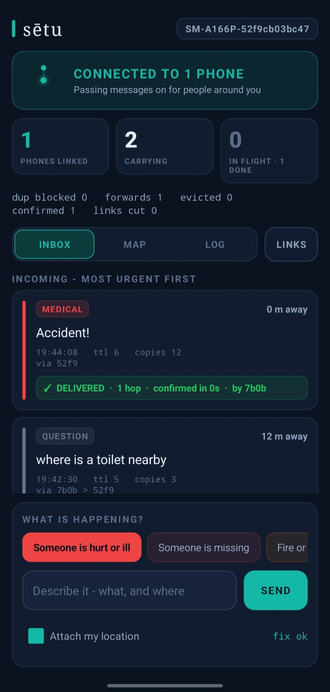
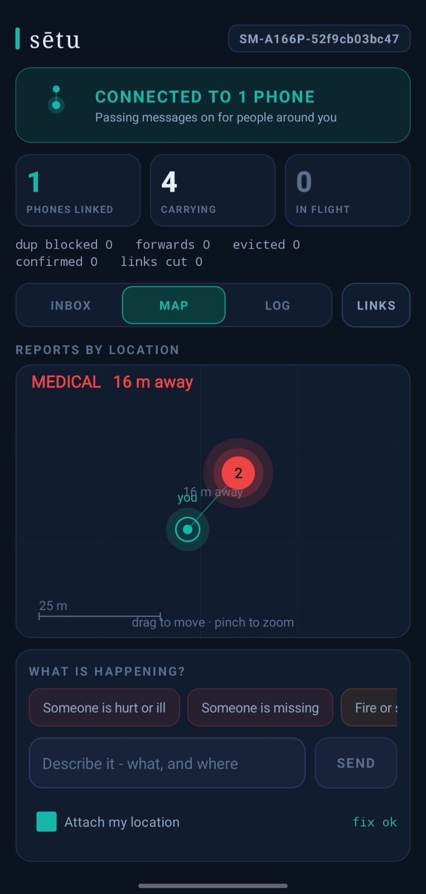
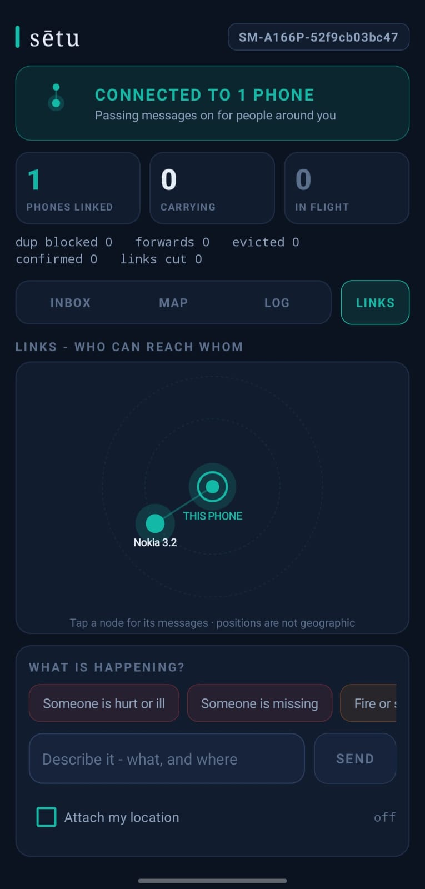

# sētu

**An emergency network that runs on the crowd itself — no tower, no internet, no server**

---

## The problem

At a festival, a stadium, or a disaster site, the cellular network fails or congests at exactly the moment people need it — because fifty thousand people are all using it at once, or because the tower is gone. A mother whose child has just disappeared looks at her phone and sees no bars.

## The idea

Normally phones **use** the network. Here, phones temporarily **become** the network.

```
conventional:   Phone → Cell Tower → Internet → Server
sētu:           Phone → Phone → Phone → Gateway → Command Centre
```

Every phone running sētu is a temporary relay. Because people move, a phone can physically *carry* a message across a venue and hand it on later. No permanent connection is required — the system exploits **encounters** instead of depending on links.

---

## Screenshots

| | |
|---|---|
| <br>**Hero** | <br>**Mesh state in the logs** |
| <br>**Urgency-sorted inbox** | <br>**Delivery confirmed** |
| <br>**Map** | <br>**Connected devices** |


---

## What it does

| Feature | What it means |
|---|---|
| **Offline phone-to-phone messaging** | Bluetooth only. No internet, Wi-Fi or SIM anywhere in the path. |
| **Multi-hop relaying** | A message passes through intermediate phones to reach devices out of direct range. |
| **Store-and-forward** | A phone holds messages while isolated and delivers them the instant it meets anyone. |
| **Automatic peer discovery and linking** | Phones find each other and agree who dials, with no user tapping "accept". |
| **Duplicate suppression** | A message seen before is dropped, so the crowd never drowns in copies. |
| **TTL and copy budget** | Two independent brakes — how *far* a message may travel, and how *many* copies may exist. |
| **Priority-based triage** | The app assigns urgency from fixed report types. The user never types "URGENT". |
| **Priority-aware eviction** | When storage fills, chatter is discarded before emergencies. |
| **Signed authority broadcasts** | Official instructions carry an ECDSA P-256 signature. Unsigned ones are refused. |
| **Spoof rejection at the first hop** | A faked evacuation order is not just rejected at the far end — it never spreads in the first place. |
| **Rate limiting** | One device cannot flood the network with false emergencies. |
| **Opt-in location** | GPS coordinates when available, a follow-up message when the fix arrives late, typed description when it never does. |
| **Delivery receipts** | The sender is told when their report reached someone who can act on it, with hop count and time. |
| **Command centre** | An urgency-sorted inbox and a live map of where reports came from — both fully offline. |

---

## The hard part

Making two phones talk over Bluetooth is easy. That is not the project.

The project is **what a phone decides**. Your message is sitting in Phone B, and Phone B suddenly sees forty other phones:

1. Which of the forty do I give it to? Most are walking the wrong way.
2. Do I keep a copy, or let go? Too many and the crowd drowns in duplicates. Too few and it dies.
3. I've seen this same message twelve times from twelve people. How do I not forward it again?
4. My storage is full. Which message do I throw away?
5. I'm holding sixty messages. Which goes first — "where's the toilet" or "my child missing"?
6. How does anyone ever know it reached the right place?
7. Someone broadcast "EVERYONE MOVE TO GATE 7." Is that real, or a prank about to cause a stampede?

All of this lives in one file, [`MeshRules.kt`](app/src/main/java/com/example/meshrelay/MeshRules.kt) — deliberately self-contained, with no Android imports, no UI and no Bluetooth in it, so it can be read as pure logic and hand-ported into the browser simulator.

> The network is optimised not for maximum data throughput, but for **maximum useful information delivered.**

### Trust

A fake *"EVERYONE MOVE TO GATE 7"* in a dense crowd can cause a stampede. So urgency and identity are treated as two separate problems:

- **Urgency decides the order.** Priority comes from the report type, is recomputed by every node, and is never sent over the wire — so an edited build cannot inject a "priority 99" message.
- **Identity decides the ceiling.** Authority broadcasts are signed with ECDSA P-256. Every app carries the public key; the private key is **never in the APK** — it is typed into the one designated command phone at runtime and never written to disk.

> **Anyone can shout "help". Only the organiser can say "everyone move."**

Only the immutable fields are signed (`id`, `origin`, `type`, `createdAt`, `text`, position) — never `ttl`, `copies` or `path`, which change at every hop and would otherwise break the signature the moment the message moved.

---

## Message format — wire version 5

Pipe-delimited rather than JSON: shorter on a slow radio, and it ports to JavaScript in ten lines. Messages stay under ~200 bytes, because Bluetooth in a dense crowd is slow and encounters are brief.

```
v5|id|origin|TYPE|lat,lon|place|ref|ttl|copies|createdAt|path|sig|text
```

| Field | Meaning |
|---|---|
| `id` | `<nodeId>-<counter>` — globally unique with no coordination |
| `origin` | which node created it |
| `TYPE` | MEDICAL, MISSING, FIRE, SECURITY, CROWD, INFO, AUTHORITY, and plumbing: LOCFIX, RECEIPT |
| `lat,lon` | opt-in coordinates, off by default |
| `place` | typed description, used when GPS never arrives |
| `ref` | the message being amended (LOCFIX) or confirmed (RECEIPT) |
| `ttl` | hops remaining |
| `copies` | copy budget, halved at every handover |
| `path` | for demo visualisation |
| `sig` | present only on AUTHORITY messages |

There is deliberately **no IP layer**. IP assumes a routed network exists; sētu assumes one doesn't. Addressing is by node ID, routing is by encounter.

---

## Priorities

```
10  AUTHORITY    Official instruction (staff)   signed, or refused everywhere
10  MEDICAL      Someone is hurt or ill
 9  MISSING      Someone is missing
 9  LOCFIX       a location catching up with a report sent without one
 9  RECEIPT      a responder confirming an urgent report arrived
 8  FIRE         Fire or smoke
 8  SECURITY     Violence or a threat
 5  CROWD        Dangerous crowding
 1  INFO         Question — not an emergency
```

---

## Project structure

```
app/src/main/java/com/example/meshrelay/
  MeshRules.kt        THE DECISION LAYER — dedup, TTL, copy budget, priority, eviction, rate limit, wire format.
  MainActivity.kt     Nearby Connections, discovery, linking, and the screen
  Authority.kt        ECDSA P-256 signing and verification; the public key
  Positioning.kt      opt-in GPS, late-location follow-ups, typed fallback
  ReportMapView.kt    offline map of where reports came from — no tiles, no basemap
  MeshGraphView.kt    live view of who is linked to whom
  MeshPulseView.kt    mesh-state radar
  MessageAdapter.kt   the urgency-sorted inbox
  Palette.kt          colours by priority
  TickingNumber.kt    animated counters

app/src/test/java/com/example/meshrelay/
  MeshRulesTest.kt    48 tests over the decision layer
```

---

## Build and run

**Requirements:** Android Studio, and a phone running **Android 7.0 or later** with Google Play Services. Three phones to see relaying properly.

```bash
git clone <this repo>
cd MeshRelay
./gradlew assembleDebug
```

The APK lands at `app/build/outputs/apk/debug/app-debug.apk`. Install it on every phone — **all phones must run the same build**, since older wire versions are refused.

**On each phone, before starting:** Bluetooth **and** Location must both be switched on. Location being off is the single most common cause of "nothing happens and there is no error" — Android requires it for nearby-device scanning even though sētu needs no location to relay.

---

## Honest limits

- **Everyone needs the app.** The realistic deployment is a sanctioned app for volunteers, security and event staff, with visitors as message sources — not a consumer download.
- **Text only, ~200 bytes.** No photos. Bluetooth throughput in a dense crowd is a few kilobytes per second and encounters last seconds.
- **It does not replace cellular.** It carries short emergency messages when cellular fails.
- **Background operation is limited.** Phone operating systems restrict background Bluetooth
  heavily; the app must stay open.
- **Location is opt-in and off by default.** This network copies messages onto strangers' phones and holds them for hours — the wrong place for anyone's exact whereabouts unless they chose it.

---

## Built with

Kotlin · Android Views · Google Nearby Connections (`P2P_CLUSTER`) · ECDSA P-256 via `java.security` · no third-party networking libraries, no backend, no cloud.

## Author

**Anshumaan Sai Patnaik**

* GitHub:  https://github.com/Anshumaan-Sai-Patnaik  
* LinkedIn:  https://www.linkedin.com/in/Anshumaan-Sai-Patnaik